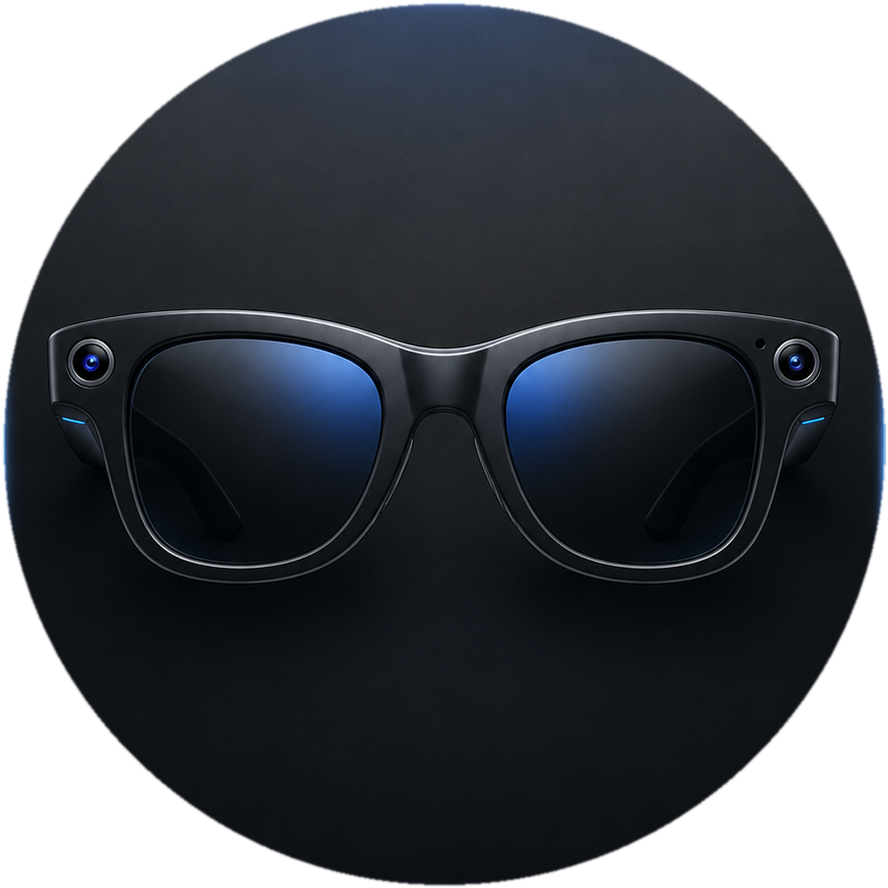
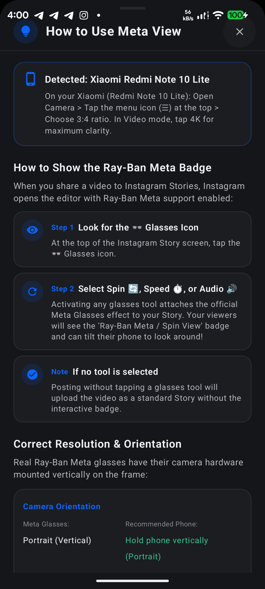
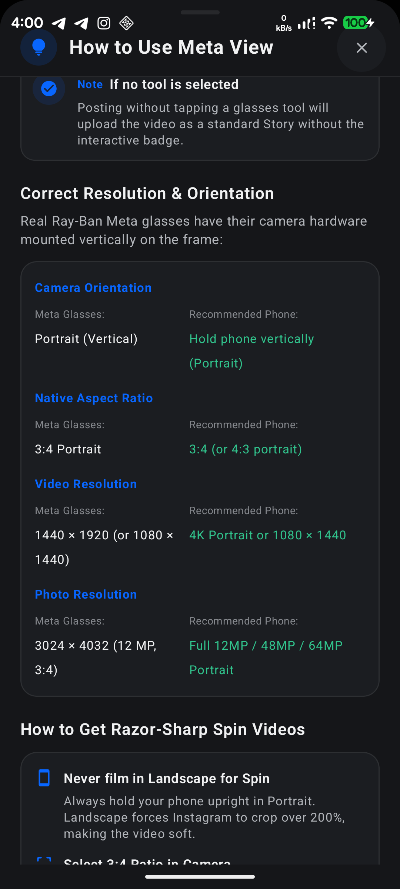
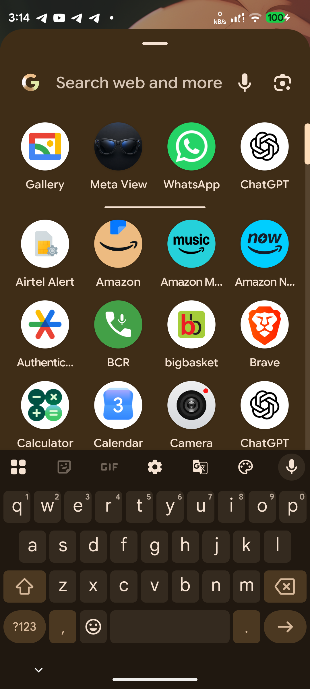

<p align="center">
  
</p>

<h1 align="center">Meta View (Android)</h1>

<p align="center">
  <b>Ray-Ban Meta Smart Glasses POV Capture, 3:4 Optical Sensor Harmonizer & Instagram Stories Ingestion Pipeline</b>
</p>

<p align="center">
  <a href="https://github.com/divyprj/meta-view-android/releases"></a>
  <a href="#"></a>
  <a href="#"></a>
  <a href="#"></a>
  <a href="LICENSE"></a>
  <a href="https://github.com/divyprj/meta-view-android/actions"></a>
</p>

---

## ⚡ Direct Download

| Distribution Channel | Package Name | Version | Build Architecture | Checksum (SHA-256) |
| :--- | :--- | :--- | :--- | :--- |
| **[Direct APK Download](release/MetaView-v1.0.0.apk)** | `com.antigravity.metacam` | **v1.0.0** | `arm64-v8a` / `armeabi-v7a` / `x86_64` | [`A326E4E7...1B9ADDA`](release/checksums.txt) |

```bash
# Verify integrity via SHA-256
sha256sum release/MetaView-v1.0.0.apk
# Target: A326E4E78EE2A09808374D8DE8AF9B0ADB1989A847188283C458CD3BA1B9ADDA
```

---

## 📖 Executive Summary

**Meta View for Android** is an enterprise-grade mobile capture companion and media processing pipeline engineered to replicate the native field-of-view, vertical sensor geometry, QuickTime metadata serialization, and Instagram Stories ingestion workflows of **Ray-Ban Meta Smart Glasses (Gen 2)** on Android devices.

By harmonizing optical sensor aspect ratios, enforcing vertical capture parity, and injecting hardware-level metadata tags, Meta View unlocks official Instagram Story glasses effects—including **Spin 🔄**, **Speed ⏱️**, and **Interactive Spatial Viewer Badges**—without requiring physical wearable hardware for previewing or publishing.

---

## 🖼️ Application Interface & System Integration

<p align="center">
  
  
  
</p>

---

## ✨ Core Engineering Capabilities

### 1. 🕶️ Native 3:4 Optical Sensor Harmonizer
* Real Ray-Ban Meta glasses feature vertical sensor hardware mounted on the frame. Meta View enforces native **3:4 portrait aspect ratio** framing, preventing standard 16:9 landscape over-cropping.
* Maintains edge-to-edge optical resolution and dynamic sensor bounds for both static photography and video streams.

### 2. ⚡ QuickTime Atom Ingestion Serialization
* Synthesizes and embeds QuickTime `moov/meta` atom structures (`com.apple.quicktime.model = "Ray-Ban Meta Smart Glasses 2"`, `com.facebook.stella`) directly into the media container.
* Formats media payloads to pass Instagram’s camera ingestion handshake, activating the interactive 👓 **Glasses Toolset** upon sharing.

### 3. 🔄 Razor-Sharp Spin & Parallax Retention
* **The 25% Cushion Secret**: When Instagram activates its gyroscopic "Spin" effect, it applies a ~25% digital zoom cushion for smooth device tilting. 
* By guiding users to capture vertical 4K media at 3:4, Meta View ensures that even after Instagram's digital crop cushion is applied, **more than 1080p of real optical resolution remains**, keeping Stories razor-sharp.

### 4. 📱 Dynamic Hardware & Device Auto-Tuning
* Automatically inspects host device manufacturer parameters (`Build.MANUFACTURER`, `Build.MODEL`) and serves instant, personalized camera configuration recommendations:
  * **Xiaomi / Redmi / POCO**: Camera ☰ Menu → 3:4 Frame → 4K Recording.
  * **Samsung Galaxy**: Top Aspect Bar → 3:4 → UHD / 4K.
  * **Google Pixel**: Settings Pull-Down → 4:3 Full Sensor → 4K Video.
  * **OnePlus / OPPO / Realme**: Frame Selector → 4:3 → 4K 60fps.

### 5. 🏷️ "Ray-Ban Meta" Badge Story Activation Guide
* Built-in visual walkthrough instructing creators on how to unlock the viewer-facing **"Ray-Ban Meta / Spin View"** badge:
  * Share media to Instagram Story → Tap the 👓 **Glasses icon** on the top toolbar → Select **Spin 🔄**, **Speed ⏱️**, or **Audio 🔊**.
  * Activating any glasses tool attaches the official interactive effect badge for followers and close friends!

---

## 🔬 Hardware vs. Recommended Phone Settings

| Parameter | Physical Ray-Ban Meta Glasses | Recommended Phone Setting (Meta View) |
| :--- | :--- | :--- |
| **Camera Orientation** | Portrait (Vertical) | **Hold phone vertically (Portrait)** |
| **Native Aspect Ratio** | 3:4 Portrait | **3:4 (or 4:3 portrait sensor mode)** |
| **Video Resolution** | 1440 × 1920 (or 1080 × 1440) | **4K Portrait (2160 × 3840) or 1080 × 1440** |
| **Photo Resolution** | 3024 × 4032 (12 MP, 3:4) | **Full 12 MP / 48 MP / 64 MP Portrait Mode** |
| **Instagram Zoom Cushion** | 25% Digital Stabilization | **Absorbed seamlessly by 4K vertical buffer** |

---

## 🛠️ System Requirements & Architecture

* **Minimum OS**: Android 10.0 (API Level 29)
* **Target OS**: Android 14.0 / 15.0 (API Level 34 / 35)
* **Architectures Supported**: `arm64-v8a`, `armeabi-v7a`, `x86_64`
* **UI Toolkit**: Jetpack Compose (Material 3 Dark Titanium Horizon Theme)
* **Image Processing**: Hardware-accelerated Coil with native Video Frame Decoders
* **Packaging**: Single Universal Production APK (~23.4 MB)

---

## 🚀 Installation Guide

1. Download **[MetaView-v1.0.0.apk](release/MetaView-v1.0.0.apk)** directly to your Android device.
2. Open your device's File Manager or Browser Downloads and tap the APK file.
3. If prompted, toggle **Allow installation from unknown sources** in your system settings.
4. Launch **Meta View** from your App Drawer or Home Screen.
5. Review the on-screen **"How to Use Meta View"** guide tailored specifically to your device model.

---

## 🔒 Security & Intellectual Property

This repository is dedicated to the public binary distribution, documentation, and technical specifications of the **Meta View** mobile application.

* **Proprietary Notice**: The proprietary algorithms, QuickTime atom packers, sensor fusion filters, and application source code are closed-source and protected under international copyright law.
* **Prohibitions**: Reverse engineering, decompilation, binary modification, redistribution, or derivation of this software is strictly prohibited under the terms of the [LICENSE](LICENSE).

---

## 👨‍💻 Maintainer & Engineering

* **Lead Architect & DevOps**: Divyansh Prajapati ([@divyprj](https://github.com/divyprj))
* **Issues & Feedback**: Please utilize the [GitHub Issue Tracker](https://github.com/divyprj/meta-view-android/issues) for structured bug reporting.

<p align="center">
  <sub>Copyright © 2026 Divyansh Prajapati. All rights reserved. Ray-Ban and Meta are registered trademarks of their respective owners.</sub>
</p>
